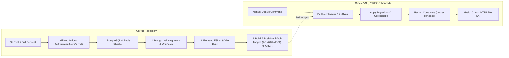

# PREX Deployment & Operations Guide (Oracle Cloud Instance)

This guide provides instructions for running **PREX** on an **Oracle Cloud Infrastructure (OCI) Compute Instance** (Ubuntu on Ampere A1 ARM64), integrating with **GitHub Actions CI**, and manually updating the application containers.

---

## 1. Overview of Workflow



---

## 2. GitHub Actions CI Pipeline

The CI workflow ([`.github/workflows/ci.yml`](.github/workflows/ci.yml)) automatically runs on pushes and pull requests:

1. **Backend CI Job (`backend`)**:
   - Launches PostgreSQL 17 and Redis 7 test containers.
   - Runs `python manage.py check` and missing migrations check (`makemigrations --check --dry-run`).
   - Executes Django backend unit test suite (37 tests).
2. **Frontend CI Job (`frontend`)**:
   - Runs ESLint on frontend codebase.
   - Builds the production bundle with Vite.
3. **Container Publishing Job (`publish-images`)**:
   - Only triggers on push to `main` (or release tags `v*.*.*`) once all tests pass.
   - Builds multi-arch container images (`linux/arm64` and `linux/amd64`) with Buildx + QEMU.
   - Pushes images to GitHub Container Registry (`ghcr.io`):
     - `ghcr.io/<owner>/prex-backend:latest`
     - `ghcr.io/<owner>/prex-frontend:latest`

---

## 3. Manual Deployment on Oracle Instance (`~/PREX-Enhanced`)

Whenever you push new changes to `main` and CI passes, log into your Oracle instance to update the running stack:

### Method A: Fast Update using `scripts/deploy.sh` (Recommended)

```bash
# 1. SSH into your Oracle instance
ssh ubuntu@<YOUR_INSTANCE_IP>

# 2. Go to your project directory
cd ~/PREX-Enhanced

# 3. Pull latest code and restart services
git pull origin main
./scripts/deploy.sh deploy
```

The script automatically pulls the newest images, runs Django migrations, collects static files, recreates containers, and runs a healthcheck verification.

---

### Method B: Manual Docker Compose Commands

```bash
# 1. SSH into your Oracle instance
ssh ubuntu@<YOUR_INSTANCE_IP>

# 2. Navigate to directory
cd ~/PREX-Enhanced

# 3. Pull latest git changes
git pull origin main

# 4. Pull updated container images from GHCR
docker compose -f docker-compose.prod.yml pull

# 5. Run database migrations and static collection
docker compose -f docker-compose.prod.yml run --rm backend python manage.py migrate --noinput
docker compose -f docker-compose.prod.yml run --rm backend python manage.py collectstatic --noinput

# 6. Recreate application containers
docker compose -f docker-compose.prod.yml up -d --remove-orphans

# 7. Check service health
curl -I http://127.0.0.1/api/v1/health/
```

---

## 4. Useful Management Commands

Inside `~/PREX-Enhanced`:

```bash
# View running container status
docker compose -f docker-compose.prod.yml ps

# View live container logs
docker compose -f docker-compose.prod.yml logs -f --tail 100 backend frontend

# Restart all services
docker compose -f docker-compose.prod.yml restart

# Prune unused docker images to save disk space
docker image prune -f
```

---

## 5. One-Time Server Setup Checklist

If setting up on a fresh Oracle Cloud Ubuntu instance:

1. **Add non-root user to docker group:**
   ```bash
   sudo usermod -aG docker ubuntu
   # Exit and reconnect SSH for group permissions to take effect
   ```

2. **Open Ubuntu Firewall Ports (80 & 443):**
   ```bash
   sudo iptables -I INPUT 6 -m state --state NEW -p tcp --dport 80 -j ACCEPT
   sudo iptables -I INPUT 6 -m state --state NEW -p tcp --dport 443 -j ACCEPT
   sudo netfilter-persistent save
   ```

3. **OCI Security List Ingress Rules:**
   Ensure TCP Ports `22` (SSH), `80` (HTTP), and `443` (HTTPS) are allowed in the Oracle Cloud VCN Security List.

4. **Production `.env.docker`:**
   Ensure `~/PREX-Enhanced/.env.docker` is present with production secrets.
